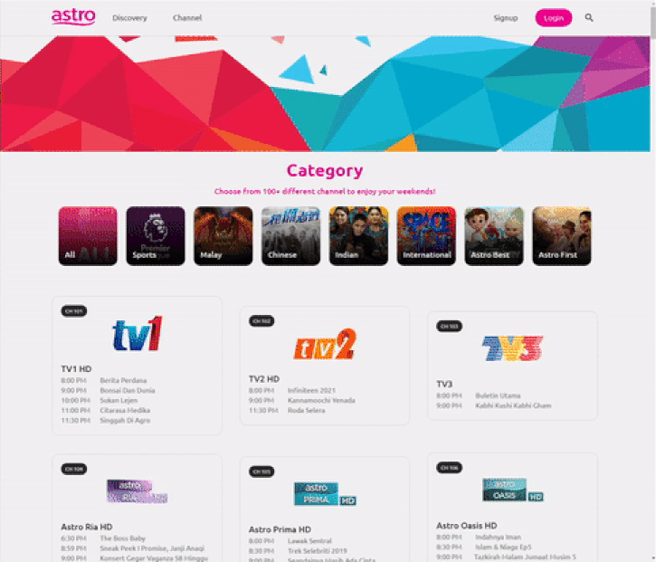

# 📺 TV Channel App

## About

Mini project app that display a list of tv channels and details of channel description using open source API, mobile
responsive and built with React.

## Installation Guide

```
  $ git clone https://github.com/syahirdev/tv-channel.git
  $ cd tv-channel
  $ npm install
  $ npm run start
```

## Demo

You can view a live demo at [tv.syahir.dev](https://tv.syahir.dev/)

## Screenshots

### 1. Filter & Search


### 2. Channel Details



### 3 . Mobile Responsive


